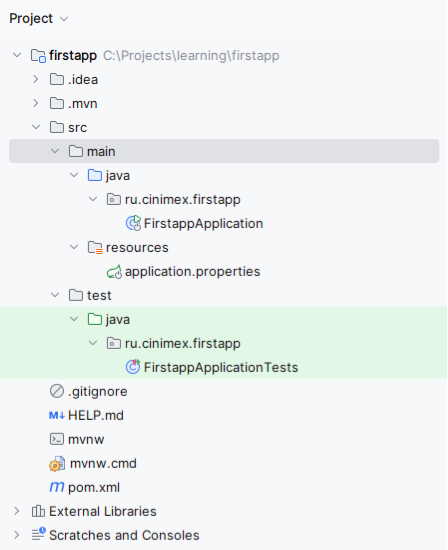
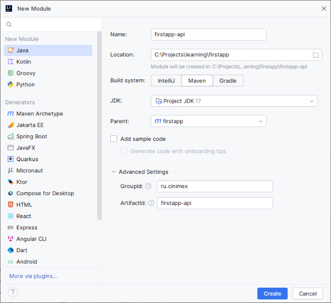
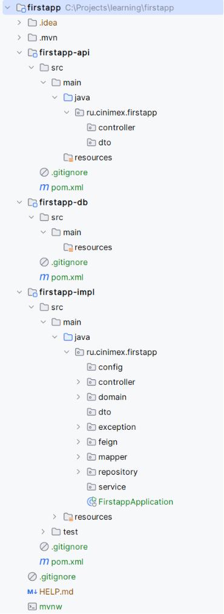
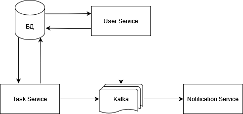

<!-- TOC -->
* [Технологии](#технологии)
  * [Git](#git)
    * [Основные понятия и команды](#основные-понятия-и-команды)
    * [Git Flow](#git-flow)
    * [Графическая оболочка для работы с git](#графическая-оболочка-для-работы-с-git)
  * [Создание проекта, структура](#создание-проекта-структура)
    * [Создание основного проекта](#создание-основного-проекта)
    * [Многомодульная структура](#многомодульная-структура)
  * [Maven](#maven)
  * [Liquibase](#liquibase)
  * [JWT (JSON Web Tokens)](#jwt-json-web-tokens)
  * [Apache Kafka](#apache-kafka)
  * [Swagger (Springdoc)](#swagger-springdoc)
  * [Spring Security](#spring-security)
  * [FeignClient](#feignclient)
  * [Specifications](#specifications)
  * [Hibernate JPA Model Generator (hibernate-jpamodelgen)](#hibernate-jpa-model-generator-hibernate-jpamodelgen)
  * [Lombok](#lombok)
  * [Spring Email](#spring-email)
  * [JUnit](#junit)
  * [Docker](#docker)
  * [Docker Compose](#docker-compose)
* [Задание](#задание)
  * [User Service](#user-service)
    * [Описание](#описание)
    * [REST API](#rest-api)
    * [База данных](#база-данных)
    * [Подробное описание](#подробное-описание)
  * [Task Service](#task-service)
    * [Описание](#описание-1)
    * [REST API](#rest-api-1)
    * [База данных](#база-данных-1)
    * [Подробное описание](#подробное-описание-1)
    * [Отправка сообщений](#отправка-сообщений)
  * [Notification Service](#notification-service)
    * [Описание](#описание-2)
    * [REST API](#rest-api-2)
    * [База данных](#база-данных-2)
    * [Подробное описание](#подробное-описание-2)
<!-- TOC -->

# Технологии

## Git

Git — это инструмент, который помогает разработчикам управлять изменениями в коде. Представьте себе, что вы пишете
большой проект, и вам нужно отслеживать, кто и какие изменения сделал, а также иметь возможность вернуться к предыдущей
версии кода, если что-то пойдет не так.

Скачать Git — <https://git-scm.com/downloads>

### Основные понятия и команды

- Репозиторий (Repository). Репозиторий — это место, где хранится ваш проект. Он содержит всю историю изменений, файлы и
  метаданные проекта. Репозиторий может быть локальным (на вашем компьютере) или удалённым (например, на GitHub).
- Коммит (Commit). Коммит — это сохранение изменений в репозитории. Каждый коммит содержит снимок состояния вашего
  проекта
  в определённый момент времени. Коммиты имеют уникальные идентификаторы (хэши) и могут включать сообщение, описывающее
  сделанные изменения.
- Ветка (Branch). Ветка — это отдельная линия разработки. Ветки позволяют работать над разными функциями или
  исправлениями
  параллельно. Основная ветка проекта часто называется `master`. Ветки могут быть объединены (слияние) для интеграции
  изменений.
- Слияние (Merge). Слияние — это процесс объединения изменений из одной ветки в другую. Например, после завершения
  работы
  над новой функцией в отдельной ветке, вы можете слить её в основную ветку.
- Конфликт (Conflict). Конфликт возникает, когда Git не может автоматически объединить изменения из разных веток. Это
  может произойти, если изменения были внесены в одну и ту же часть файла. Конфликты нужно решать вручную.
- Удаленный репозиторий (Remote Repository). Удаленный репозиторий — это версия вашего репозитория, которая хранится на
  сервере, таком как `GitHub`, `GitLab` или `Bitbucket`. Удаленные репозитории используются для совместной работы и
  резервного
  копирования.
- Клонирование (Clone). Клонирование — это процесс создания копии удаленного репозитория на вашем локальном компьютере.
  Команда `git clone` используется для клонирования репозитория.
- Фетч (Fetch). Команда `git fetch` загружает изменения из удаленного репозитория, но не объединяет их с вашим локальным
  репозиторием. Это позволяет вам видеть, какие изменения были внесены другими, прежде чем интегрировать их.
- Пулл (Pull). Команда `git pull` загружает изменения из удаленного репозитория и автоматически объединяет их с вашим
  локальным репозиторием. Это сочетание команд `git fetch` и `git merge`.
- Пуш (Push). Команда `git push` отправляет ваши локальные изменения в удаленный репозиторий. Это позволяет другим
  видеть и
  использовать ваши изменения.
- Индекс (Index). Индекс — это область, где хранятся изменения, готовые для коммита. Команда `git add` используется для
  добавления изменений в индекс.
- .gitignore. Файл `.gitignore` содержит список файлов и директорий, которые Git должен игнорировать. Это полезно для
  исключения временных файлов, конфигураций и других ненужных элементов. Файл, как правило, располагается в корневой
  папке
  проекта и в подмодулях.
- Тег (Tag). Тег — это метка, которая используется для обозначения определённых точек в истории коммитов.
  Теги позволяют легко находить и обращаться к версиям проекта.
- Ребейз (Rebase). Команда `git rebase` позволяет перенести или объединить серию коммитов с одной ветки на другую. Это
  может
  помочь сделать историю коммитов более чистой и линейной.
- Чек-аут (Checkout). Команда `git checkout` позволяет переключаться между ветками или восстанавливать файлы до
  определённого состояния из истории коммитов.
- Хед (HEAD). `HEAD` — это указатель на текущий коммит или ветку, на которой вы сейчас находитесь. Обычно `HEAD`
  указывает на
  последний коммит в текущей ветке.

### Git Flow

Есть несколько правил и рекомендаций для организации работы с Git. Как правило, они выбираются в зависимости от проекта
и зависят, например, от размера команды, частоты релизов и т.д. Подробнее про них можно почитать
тут <https://bool.dev/blog/detail/git-branching-strategies>. Ниже перечислены основные названия и применение веток,
которые могут быть применимы к разным flow.

- `master`: Основная ветка, содержащая стабильный и готовый к выпуску код.
- `develop`: Ветка для разработки, содержащая последний интегрированный код.
- `feature/*`: Ветки для разработки новых функций. Создаются от `develop` и после завершения работы сливаются обратно в
  `develop`.
- `release/*`: Ветки для подготовки к релизу. Создаются от develop и после завершения работы сливаются в `master` и
  develop.
- `hotfix/*`: Ветки для исправления критических ошибок. Создаются от master и после завершения работы сливаются
  в `master`
  и develop.

### Графическая оболочка для работы с git

Для работы с git можно использовать консоль и писать команды вручную, однако удобнее использовать графические оболочки.
В IntelliJ IDEA есть встроенное GUI для работы с git, но можно рассмотреть и альтернативные варианты, например
Sourcetree.

Скачать <https://www.sourcetreeapp.com>

## Создание проекта, структура

### Создание основного проекта

Создадим новое Spring Boot приложения с использованием Maven.

Для этого можно воспользоваться сервисом [https://start.spring.io](https://start.spring.io/) или создать новое
приложение сразу в `IntelliJ IDEA`. Будем использовать второй вариант, для этого выберем `File -> New -> Project`. В
диалоговом окне слева выберем Spring Boot и заполним поля.


**Type**: Maven.  
**Language**: Java.  
**Group**: Группа проекта, например, ru.cinimex  
**Artifact**: Название сервиса, например, firstapp.  
**Name:** Название сервиса, например, firstapp.  
**Description:** Описание, например, First Spring Boot Project.  
**Package name**: По умолчанию будет ru.cinimex. firstapp.  
**Packaging**: Jar.  
**Java**: 17.

На следующем экране можно выбрать версию Spring Boot и дополнительные зависимости.

Нажмем на кнопку Create. Мы должны получить следующую структуру



### Многомодульная структура

Многомодульная структура позволяет разделить проект на логически изолированные части, что облегчает управление,
тестирование и повторное использование кода. Модули могут иметь разные названия и назначения, но мы будем использовать
три модуля:

- `api` - предназначен для хранения интерфейсов контроллеров и DTO;
- `db` - предназначен для хранения миграций базы данных;
- `impl` - содержит всю остальную логику приложения, включая реализации сервисов, репозиториев и бизнес-логику.

Для добавления модуля щёлкнем правой кнопкой мыши на корневом проекте в дереве проекта и выберите New -> Module. В
диалоговом окне слева выберем Java и заполним поля:

**Group:** ru.cinimex  
**Artifact:** firstapp-api  
**Name:** firstapp-api  
**Parent:** firstapp (должен быть главный модуль)



Аналогично заполняем для остальных модулей.

После добавления всех модулей нужно провести небольшой рефактор структуры. Удалим папку `src` из модуля `impl` и
перенесем
туда папку `src` из главного модуля. Удалим папку `src/test` из модуля api. Удалим папки `src/test` и `src/main/java` из
модуля
`db`. Скопируем файл `.gitignore` из корневого модуля в три дочерние.

Добавим базовые пакеты в модуль `api` и `impl`. Пакеты можно добавлять по мере их надобности. Пример получившейся
структуры:



## Maven

**Описание:**
Maven — это инструмент для управления проектами и автоматизации сборки, используемый в Java. Он предоставляет
стандартизированный способ управления зависимостями, компиляции, тестирования и упаковки приложений. Maven использует
файл конфигурации `pom.xml` (Project Object Model), который описывает проект, его зависимости, плагины и цели сборки.

Пример конфигурация `pom.xml` можно посмотреть в текущем проекте.

## Liquibase

**Описание:**
Liquibase — это инструмент для управления версиями базы данных, который позволяет отслеживать, управлять и применять
изменения схемы базы данных. Он поддерживает различные типы баз данных и позволяет автоматизировать процесс миграции.

Все миграции в микросервисе должны находиться в модуле `-db` в папке `resources`. Пример пустой миграции находится
текущем проекте. Запустить миграции можно командой:

```
mvn install liquibase:update -f firstapp-db/pom.xml -Dliquibase.host=localhost -Dliquibase.port=5432 -Dliquibase.db=db_name -Dliquibase.schema=frstapp -Dliquibase.user=postgres -Dliquibase.password=postgres
```

подставив переменные для своей БД.

**Полезные ссылки:**

- [Liquibase Official Documentation](https://www.liquibase.org/documentation/index.html)

## JWT (JSON Web Tokens)

**Описание:**
JWT (JSON Web Tokens) — это стандарт для создания токенов доступа, которые могут быть использованы для аутентификации и
авторизации. JWT состоит из трех частей: заголовка, полезной нагрузки и подписи.

**Полезные ссылки:**

- [JWT Parser](https://jwt.io)

## Apache Kafka

**Описание:**
Apache Kafka — это распределённая потоковая платформа, которая используется для построения систем реального времени.
Kafka позволяет публиковать и подписываться на потоки записей, сохранять потоки записей и обрабатывать их.

**Полезные ссылки:**

- [Apache Kafka Official Documentation](https://kafka.apache.org/documentation/)
- [Spring Boot + Kafka Integration Example](https://www.baeldung.com/spring-kafka)

## Swagger (Springdoc)

**Описание:**
Springdoc OpenAPI — это библиотека, которая автоматизирует генерацию документации OpenAPI 3.0 для RESTful API,
реализованных на основе Spring Boot. Она предоставляет аннотации и конфигурации для легкой интеграции и генерации
спецификации API.

**Полезные ссылки:**

- [Springdoc OpenAPI Official Documentation](https://springdoc.org/)
- [Spring Boot + Springdoc OpenAPI Integration Example](https://www.baeldung.com/spring-rest-openapi-documentation)

## Spring Security

**Описание:**
Spring Security — это мощный и настраиваемый фреймворк для обеспечения безопасности приложений на платформе Spring. Он
предоставляет все необходимые средства для аутентификации и авторизации пользователей, защиты веб-приложений от
различных атак (например, CSRF, XSS) и управления доступом на основе ролей и политик.

**Полезные ссылки:**

- [Spring Security Official Documentation](https://docs.spring.io/spring-security/reference/index.html)
- [Creating a Spring Security Key for Signing a JWT Token](https://www.baeldung.com/spring-security-sign-jwt-token)

## FeignClient

**Описание:**
FeignClient — это декларативный веб-клиент для упрощения вызовов REST API. Он интегрируется с Spring Boot и позволяет
легко взаимодействовать с другими микросервисами, используя аннотации для определения HTTP-запросов.

**Полезные ссылки:**

- [Spring Boot + FeignClient Integration Example](https://www.baeldung.com/spring-cloud-openfeign)

## Specifications

**Описание:**
Specifications — это часть Spring Data JPA, которая позволяет создавать динамические запросы к базе данных с
использованием критериев (Criteria API). Они предоставляют мощный и гибкий способ построения сложных запросов.

Для использования нужно подключить [hibernate-jpamodelgen](#hibernate-jpa-model-generator-hibernate-jpamodelgen).

**Полезные ссылки:**

- [Ищем с помощью Spring Data JPA](https://uthark.github.io/2012/04/24/spring-data-jpa/)

## Hibernate JPA Model Generator (hibernate-jpamodelgen)

**Описание:**
Hibernate JPA Model Generator (hibernate-jpamodelgen) — это инструмент для автоматической генерации метамоделей JPA.
Метамодели используются для создания типобезопасных запросов с использованием Criteria API.

**Подключение:**

```xml

<dependency>
    <groupId>org.hibernate.orm</groupId>
    <artifactId>hibernate-jpamodelgen</artifactId>
</dependency>
```

## Lombok

**Описание:**
Lombok — это библиотека для Java, которая значительно упрощает разработку, устраняя необходимость написания шаблонного
кода. Lombok аннотирует классы и автоматически генерирует код, такой как геттеры, сеттеры, конструкторы,
методы `equals`, `hashCode`, `toString` и многое другое.

**Полезные ссылки:**

- [Lombok Official Documentation](https://projectlombok.org/)
- [Spring Boot + Lombok Integration Example](https://www.baeldung.com/intro-to-project-lombok)

## Spring Email

**Описание:**
Spring Email — это часть Spring Framework, которая предоставляет удобный способ отправки email-сообщений с
использованием JavaMailSender. Spring Email интегрируется с различными email-серверами и позволяет легко конфигурировать
и отправлять email-сообщения в приложениях Spring Boot.

**Полезные ссылки:**

- [Spring Boot + Email Integration Example](https://www.baeldung.com/spring-email)

## JUnit

**Описание:**
JUnit — это популярный фреймворк для написания и выполнения тестов на языке программирования Java. JUnit поддерживает 
создание тестов, выполнение тестов, сбор и анализ результатов тестирования.

**Полезные ссылки:**

- [JUnit 5 User Guide](https://junit.org/junit5/docs/current/user-guide/)  
- [Spring Boot Testing](https://docs.spring.io/spring-boot/docs/current/reference/html/features.html#features.testing)  
- [Testing with Spring Boot](https://spring.io/guides/gs/testing-web/)  
- [Guide to Testing with Spring Boot](https://www.baeldung.com/spring-boot-testing)


## Docker

**Описание:**
Docker - это платформа для автоматизации развёртывания, масштабирования и управления приложениями в контейнерах.
Она позволяет разработчикам упаковывать приложения и все необходимые зависимости в стандартизированные единицы,
которые могут работать в любом окружении, обеспечивая консистентность и изоляцию.

### Сборка образа

В модулях `-db` и `-impl` текущего проекта находятся примеры Dockerfile.  
Для самостоятельной сборки образа нужно сначала собрать проект `mvn package`, после этого в папке `target`
появятся `.jar` файлы, имена которых нужно указать в Dockerfile.
В командной строке, находясь в нужном модуле, выполнить команду `docker build . -t firstapp-db` для сборки образа в
модуле `-db`, и `docker build . -t firstapp` для сборки образа модуле `-impl`.

**Полезные ссылки:**

- [Introduction to Docker](https://habr.com/ru/companies/ruvds/articles/438796/)
- [Docker Documentation](https://docs.docker.com)

## Docker Compose

**Описание:**
Docker Compose - это инструмент, предназначенный для определения и управления многоконтейнерными Docker-приложениями. 
С помощью файла `docker-compose.yml` можно описать конфигурацию всех контейнеров, сетей и томов, 
необходимых для работы приложения, и запускать их одной командой.

### Запуск сервисов
В папке `compose` основного модуля находится пример docker compose файла. Для запуска сервисов выполнить команду
`docker-compose up`. Образы из модулей `-db` и `-impl` должны быть предварительно собраны. 

Для создания схемы БД используется скрипт `compose/postgres/init/init.sql`.  
Задать environment переменные можно в самом `docker-compose.yml`, как это сделано для модуля `-db`, так и в отдельном файле
`compose/firstapp/application.env` как это сделано для модуля `-impl`.

**Полезные ссылки:**

- [Introduction to Docker Compose](https://habr.com/ru/companies/ruvds/articles/450312/)
- [Docker Compose Documentation](https://docs.docker.com/compose/)


# Задание

**Тема:** Система отправки напоминаний пользователям

**Описание:** Система для напоминаний о задачах должна автоматически отправлять пользователям уведомления о предстоящих
задачах. Она должна позволять пользователям настраивать дату и время отправки уведомлений, а так же их периодичность.

Система состоит из трех микросервисов:

- User Service
- Task Service
- Notification Service



Сервисы, а также необходимые для них компоненты (Postgresql и [Apache Kafka](#apache-kafka)), должны запускаться через [Docker Compose](#docker-compose).


## User Service

### Описание

Сервис должен предоставлять REST API для регистрации и аутентификация пользователей, а так же дополнительные API для
администратора. В сервисе должен быть настроен [spring security](#spring-security) для
выдачи [JWT](#jwt-json-web-tokens) токенов зарегистрированным пользователям.

### REST API

- POST /register - Регистрация нового пользователя.
- POST /register/code - Подтверждение почты с помощью кода.
- POST /auth/login - Аутентификация пользователя
- GET /users/current - Получить информацию о текущем пользователе
- GET /admin/users/{id} - Получить информацию о пользователе по ID администратором

### База данных

Таблица user:

``` postgresql
  id uuid (обязательное, первичный ключ)
  username varchar(100) (обязательное, уникальное, добавить индекс)
  password varchar(255) (обязательное)
  email varchar(200)(обязательное, уникальное)
  role varchar(10) (обязательное, варианты значений [USER, ADMIN])
  is_active boolean (обязательное, по умолчанию false)
  created_at timestamptz (обязательное)
  updated_at timestamptz (обязательное)
```

Таблица temp_code:

``` postgresql
  id uuid (обязательное, первичный ключ)
  user_id uuid (обязательное, внешний ключ на таблицу user)
  code varchar(6) (код подтверждения, обязательное)
```

### Подробное описание

Создать сервис с тремя модулями `-api`, `-db`, `-impl`.

В модуле `-api` должны быть интерфейсы двух контроллеров (контроллер с регистрацией и аутентификацией пользователя,
и контроллер с получением информации о пользователе), а также классы dto, которые используются в интерфейсах.

Модуль `-db` должен содержать файлы миграции [Liquibase](#liquibase) для создания структуры БД. Нужно добавить 2 changeSet - создание
таблицы user и создание таблицы temp_code, каждый changeSet поместить в отдельный файл.
Модуль должен собираться в jar файл.

Модуль `-impl` должен содержать основные класса для работы приложения. В данный модуль должен подключаться модуль `-api`
для реализации интерфейсов. Модуль также должен собираться в jar файл.

В сервис нужно подключить [Lombok](#lombok) и расставить нужные аннотации.
В сервис нужно подключить [Swagger](#swagger-springdoc) и расставить нужные аннотации для описания API.
В сервисе нужно подключить [spring security](#spring-security) и настроить ее для выдачи и
проверки [JWT](#jwt-json-web-tokens) токенов.
Пример можно найти в текущем проекте.
Реализация REST API GET /users/current должна быть помечена аннотацией `@PreAuthorize` с указанием роли USER,
реализация GET /admin/users/{id} должны быть помечены аннотацией `@PreAuthorize` с указанием роли ADMIN.
В сервисе должна быть подключена [Kafka](#apache-kafka) и должен быть сконфигурирован `Producer` для отправки сообщения в топик
`notification.message.in`.

Покрыть все публичные методы классов в папке service `unit` и контроллеры тестами с помощью [JUnit](#junit).

Собрать [Docker](#docker) образ для `-db` и `-impl` модулей.

- #### POST /register
  **Входящие данные:** json c данными пользователя, например
  ```json
  {
    "username": "ivan",
    "password": "123",
    "email": "ivan@gmail.com"
  }
  ```
  **Алгоритм работы:**  
  Проверить, что пользователь с таким `username` или `email` не зарегистрирован в системе, то есть нет записей с таким
  `username` или `email` в таблице user и поле `is_active = false`. Если пользователь уже зарегистрирован — выбросить
  исключение.
  Используя Mapstruct, конвертировать входящее DTO в `UserEntity`, использовать аннотацию `@AfterMapping` для
  заполнения остальных полей:
  ```
  id = рандомный UUID
  role = USER
  created_at = текущее дата и время
  updated_at = текущее дата и время
  password = использовать бин PasswordEncoder для хеширования пароля
  ```
  Заполнить таблицу `temp_code` (без маппера):
  ```
  id = рандомный UUID
  user_id = id из UserEntity
  code = случайный 6-значный цифровой код
  ```
  Сохранить изменения в БД. Все действия выше должны быть в одной транзакции.
  Отправить сообщение в сервис `Notification Service` через [Kafka](#apache-kafka). Пример сообщения
  ```json
  {
    "email": "ivan@gmail.com",
    "header": "Подтверждение почты",
    "body": "Ваш код подтверждения - 653218"
  }
  ```

  **Возвращаемое значение:**
    - HTTP code 200 и `id` созданной `UserEntity`, если пользователь успешно создан
    - HTTP code 400 и описание ошибки, если пользователь уже существует
    - HTTP code 500 и описание ошибки, если произошла другая ошибка


- #### POST /register/code

  **Входящие данные:**  
  json c кодом подтверждения и id пользователя, например
  ```json
  {
    "id": "c0c4a8d4-762f-4496-bfe0-06d0c19ebc8c",
    "code": "653218"
  }
  ```
  **Алгоритм работы:**  
  По переданному `id` найти пользователя в таблице `user`, проверить, что у данного пользователя стоит
  `is_active = false,` найти связанную таблицу `temp_code`, проверить, что переданный код совпадает с полем code
  в таблице. Если пользователя не существует или последующие проверки не пройдены - выбросить исключение.

  Если все проверки пройдены, установить пользователю `is_active = true,` обновить поле `updated_at`, удалить
  соответствующую
  запись из таблицы `temp_code`.
  <br><br>
  **Возвращаемое значение:**
    - HTTP code 200 если код совпал
    - HTTP code 400, если произошла ошибка из перечисленных
    - HTTP code 400 и описание ошибки, если пользователя с таким id не существует или последующие проверки не пройдены
    - HTTP code 500 и описание ошибки, если произошла другая ошибка


- #### POST /auth/login
  **Входящие данные:**  
  Логин и пароль пользователя, например
  ```json
  {
    "username": "ivan",
    "password": "123"
  }
  ```
  **Алгоритм работы:**  
  Выполнить аутентификацию с использованием `username` и `password`. Если аутентификация прошла успешно, сгенерировать
  [JWT](#jwt-json-web-tokens) токен и вернуть его пользователю, иначе выбросить исключение. Подробный пример можно найти
  внутри проекта.
  <br><br>
  **Возвращаемое значение:**
    - HTTP code 200 и [JWT](#jwt-json-web-tokens) token
    - HTTP code 403, если логин и пароль не правильные
    - HTTP code 500 и описание ошибки, если произошла другая ошибка

- #### GET /users/current
  **Входящие данные:**  
  Нет
  <br><br>
  **Алгоритм работы:**  
  Из [JWT](#jwt-json-web-tokens) токена получить логин пользователя и вернуть json c информацией по нему, например
  ```json
  {
    "username": "ivan",
    "email": "ivan@gmail.com",
    "role": "USER"
  }
  ```
  **Возвращаемое значение:**
    - HTTP code 200 и json c информацией о пользователе
    - HTTP code 401, если не передан [JWT](#jwt-json-web-tokens) токен
    - HTTP code 403, если пользователь не имеет нужной роли
    - HTTP code 500 и описание ошибки, если произошла другая ошибка

- #### GET /admin/users/{id}
  **Входящие данные:**  
  `id` пользователя
  <br><br>
  **Алгоритм работы:**  
  По переданному `id`
  <br><br>
  **Возвращаемое значение:**
    - HTTP code 200 и json c информацией о пользователе
    - HTTP code 401, если не передан [JWT](#jwt-json-web-tokens) токен
    - HTTP code 403, если пользователь не имеет нужной роли
    - HTTP code 500 и описание ошибки, если произошла другая ошибка

## Task Service

### Описание

Сервис должен предоставлять REST API для создания, получения, обновления и удаления задач.

### REST API

- POST /tasks - Создать новую задачу
- GET /tasks - Получить список задач текущего пользователя
- GET /tasks/{id} - Получить информацию о задаче по ID
- PUT /tasks/{id} - Обновить задачу по ID
- DELETE /tasks/{id} - Удалить задачу по ID

### База данных

Таблица task:

```postgresql
   id uuid (обязательное, первичный ключ)
   title text (обязательное)
   description text (необязательное)
   status varchar(20) (обязательное, варианты значений [CREATED, DONE, ERROR])
   assignee_id uuid (обязательное, идентификатор пользователя)
   created_at timestamptz (обязательное)
   updated_at timestamptz (обязательное)
   notificate_at timestamptz (обязательное)
```

### Подробное описание

Создать сервис с тремя модулями `-api`, `-db`, `-impl`.

В модуле `-api` должны быть интерфейс контроллера, а также классы dto, которые используются в интерфейсе.

Модуль `-db` должен содержать файлы миграции [Liquibase](#liquibase) для создания структуры БД. Нужно добавить 1 changeSet - создание
таблицы task. Модуль должен собираться в `jar` файл.

Модуль `-impl` должен содержать основные класса для работы приложения. В данный модуль должен подключаться модуль `-api`
для реализации интерфейсов. Модуль также должен собираться в `jar` файл.

В сервис нужно подключить [Lombok](#lombok) и расставить нужные аннотации.
В сервисе нужно подключить [spring security](#spring-security) и настроить ее для проверки [JWT](#jwt-json-web-tokens)
токенов. Пример можно
найти в текущем проекте.
В сервис нужно подключить [Swagger](#swagger-springdoc) и расставить нужные аннотации для описания API.
Реализация всех REST API должны быть помечены аннотацией `@PreAuthorize` с указанием роли USER и ADMIN.
В сервисе должна быть подключена [Kafka](#apache-kafka) и должен быть сконфигурирован `Producer` для отправки сообщения в топик
`notification.message.in`.

Покрыть все публичные методы классов в папке service `unit` и контроллеры тестами с помощью [JUnit](#junit).

Собрать [Docker](#docker) образ для `-db` и `-impl` модулей.

- #### POST /tasks
  **Входящие данные:**  
  json с данными задачи, например
  ```json
  {
    "title": "Название задачи",
    "description": "Описание задачи, может быть null",
    "notificate_at": "2024-08-14T13:52:22"
  }
  ```
  **Алгоритм работы:**  
  Проверить, что дата из поля `notificate_at` больше текущей, если это не так, выбросить исключение.
  Используя Mapstruct, конвертировать входящее DTO в `TaskEntity`, использовать аннотацию `@AfterMapping` для
  заполнения остальных полей:
  ```
  id = рандомный UUID
  status = CREATED
  created_at = текущее дата и время
  updated_at = текущее дата и время
  assignee_id = id пользователя из jwt
  ``` 
  Сохранить `TaskEntity` в базу.
  <br><br>
  **Возвращаемое значение:**
    - HTTP code 200 и id созданной задачи
    - HTTP code 401, если не передан [JWT](#jwt-json-web-tokens) токен
    - HTTP code 403, если пользователь не имеет нужной роли
    - HTTP code 500 и описание ошибки, если произошла другая ошибка

- #### GET /tasks
  **Входящие данные:**  
  Поля для фильтра title, status, notificate_at_start, notificate_at_end
  <br><br>
  **Алгоритм работы:**  
  Получить из таблицы `task` список задач текущего пользователя. Использовать [Specifications](#specifications) для создания запроса к БД
  (поля, по которым проводить фильтрацию взять из входящих параметров), `id` пользователя взять
  из [JWT](#jwt-json-web-tokens).
  <br><br>
  **Возвращаемое значение:**
    - HTTP code 200 и json со списком задач
    - HTTP code 401, если не передан [JWT](#jwt-json-web-tokens) токен
    - HTTP code 403, если пользователь не имеет нужной роли
    - HTTP code 500 и описание ошибки, если произошла другая ошибка


- #### GET /tasks/{id}
  **Входящие данные:**  
  `id` созданной задачи
  <br><br>
  **Алгоритм работы:**  
  Получить из таблицы `task` запись по `id` из параметров запроса. Если такой задачи не существует выбросить исключение.
  Проверить, что в поле `assignee_id` равно `id` пользователя из [JWT](#jwt-json-web-tokens), если это не так, выбросить
  исключение.
  <br><br>
  **Возвращаемое значение:**
    - HTTP code 200 и json с данными по задаче
    - HTTP code 400, если произошла ошибка из перечисленных
    - HTTP code 401, если не передан [JWT](#jwt-json-web-tokens) токен
    - HTTP code 403, если пользователь не имеет нужной роли
    - HTTP code 500 и описание ошибки, если произошла другая ошибка

- #### PUT /tasks/{id}
  **Входящие данные:**  
  `id` созданной задачи и json с данными задачи, например
  ```json
   {
     "title": "Название задачи",
     "description": "Описание задачи, может быть null",
     "notificate_at": "2024-08-14T13:52:22"
   }
   ```
  **Алгоритм работы:**  
  Получить из таблицы `task` запись по `id` из параметров запроса. Если такой задачи не существует, выбросить
  исключение.
  Проверить, что статус задачи равен `CREATED`, если это не так, выбросить исключение.
  Проверить, что в поле `assignee_id` равно `id` пользователя из [JWT](#jwt-json-web-tokens), если это не так, выбросить
  исключение.
  Обновить значение полей из входящих данных используя Mapstruct, использовать аннотацию `@AfterMapping` для
  заполнения остальных полей:
  ```
    updated_at = текущее дата и время
  ``` 

  **Возвращаемое значение:**
    - HTTP code 200
    - HTTP code 400, если произошла ошибка из перечисленных
    - HTTP code 401, если не передан [JWT](#jwt-json-web-tokens) токен
    - HTTP code 403, если пользователь не имеет нужной роли
    - HTTP code 500 и описание ошибки, если произошла другая ошибка

- #### DELETE /tasks/{id}
  **Входящие данные:**  
  `id` созданной задачи
  <br><br>
  **Алгоритм работы:**  
  Получить из таблицы `task` запись по `id` из параметров запроса. Если такой задачи не существует, выбросить
  исключение.
  Проверить, что статус задачи равен `CREATED`, если это не так, выбросить исключение.
  Проверить, что в поле `assignee_id` равно `id` пользователя из [JWT](#jwt-json-web-tokens), если это не так, выбросить
  исключение.
  Удалить запись из БД.

  **Возвращаемое значение:**
    - HTTP code 200
    - HTTP code 400, если произошла ошибка из перечисленных
    - HTTP code 401, если не передан [JWT](#jwt-json-web-tokens) токен
    - HTTP code 403, если пользователь не имеет нужной роли
    - HTTP code 500 и описание ошибки, если произошла другая ошибка

### Отправка сообщений
Реализовать метод отправки сообщений в [Kafka](#apache-kafka) по шедулеру. Использовать `cron` выражения для настройки
интервала отправки, по умолчанию раз в минуту (вынести параметром в `application.yml`).

**Алгоритм работы:**  
Получить и заблокировать `n` записей из таблицы `task` со `status = CREATED` . Сформировать сообщения
в [Kafka](#apache-kafka) и отправить. Если отправка прошла успешно, проставить всем записям `status = DONE`. Сохранить
изменения в БД и отпустить блокировку, если произошла ошибка, проставить записям `status = ERROR` и отпустить блокировку.  
Параметр `n` вынести в `application.yml`, по умолчанию 5.
Блокировку сделать через репозиторий и аннотации
```java
@Lock(LockModeType.PESSIMISTIC_WRITE)
@QueryHints({@QueryHint(name = "javax.persistence.lock.timeout", value = "-2")})
```
[Подробнее тут](https://docs.jboss.org/hibernate/orm/5.2/userguide/html_single/chapters/locking/Locking.html#locking-LockMode)


## Notification Service

### Описание

Сервис для отправки сообщений по email.

### REST API

Нет.

### База данных

Нет.

### Подробное описание

Создать сервис с одним модулями `-impl`. Настроить отправку email с помощью [Spring Email](#spring-email).
В сервисе должна быть подключена [Kafka](#apache-kafka) и должен быть сконфигурирован `Consumer` для прослушивания сообщений
из топика `notification.message.in`.
В сервис нужно подключить [Lombok](#lombok) и расставить нужные аннотации.

Покрыть все публичные методы классов в папке service `unit` тестами с помощью [JUnit](#junit).

Собрать [Docker](#docker) образ для `-impl` модуля.
